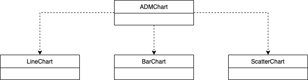
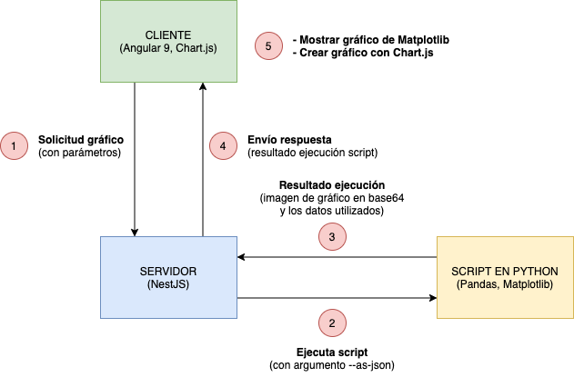

# Visualización de Datos II
**Puede acceder a la demo de la aplicación en [http://edu.ajmonfue.me/adm-2/](http://edu.ajmonfue.me/adm-2/)**

## Enunciados
### 1. Lee el documento "Why scientists need to be better at data visualizationURL" desde la sección "Ruinous rainbows" hasta el final del mismo. Haz un resumen de no más de una página con las conclusiones que obtienes.

El color es una herramienta muy útil en la representación de los datos, sin embargo, si se hace un mal uso, que es lo común, puede complicar el entendimiento o mostrar información distinta a la deseada.

Una de las malas prácticas más comunes es usar la escala de colores del arco iris, la cual puede tener distintas interpretaciones debido a la percepción, entendimiento o capacidad fisiológica  del espectador (orden de los colores, daltonismo), para lo cual se han ideado otras escalas (Cividis, Viridis, Parula), las cuales están diseñadas para representar mejor los datos subyacentes, facilitar la lectura o, como el caso de Cividis, para ser legible por personas daltónicas.

Sin embargo, a pesar de las nuevas escalas, la escala de colores del arco iris sigue siendo la predominante, puesto que desde los iniciales ha sido la más común y a la que la gente está acostumbrada.

### 2. Para el framework de visualización desarrrollado en la práctica anterior, incorpora las modificaciones planteadas por el profesor durante la sesión de evaluación, entre ellas, el ajuste dinámico de los ejes en función del conjunto de datos a representar.

#### Incorporación de librería JS para la representación de las gráficas
Se ha implementada esta mejora con el fin de mejorar la usabilidad y otorgar al usuario una experencia interactiva con la gráfica. Para ello se ha incorporado [`Chart.js`](https://www.chartjs.org/) a la implementación del cliente y añadido la implementación para generar los gráficos análogos a los generados por Matplotlib. Dichos gráficos, creados con Chart.js, son generados a partir de los mismos datos usados por Matplotlib.

#### Indicar la función a ejecutar en la agrupación de datos
Actualmente, la función que el script en python ejecutaba para la agrupación de los datos era la suma, sin embargo Matplotlib implementa tambien otras; producto, mínimo, máximo, primera ocurrencia y última ocurrencia. Para lo cual, con el fin de indicar la función de agrupación a usar, se ha añadido un nuevo argumento al script, `--group-by-func`, el cual pude tener uno de los siguientes valores: `sum`, `prod`, `min`, `max`, `first` o `last` y  por defecto es `sum`. De igual forma, se ha añadido en el formulario del cliente un selector asociado a este nuevo argumento.

### 3. Incorpora en el entorno anterior la posibilidad de comparar múltiples grupos (introduciendo multiples líneas o barras) mediante la selección previa de los elementos a comparar.
Para esto se ha permitido seleccionar múltiples campos por eje, sin embargo para que la gráfica se renderize correctamente, sólo se pueden especificar para un eje a la vez.

En el caso de seleccionarlos en el eje `X`, estos representarán cada posición de dicho eje; y el campo seleccionado del eje `Y` represetará, por un lado, el campo de agrupación de los datos, y por otro, por cada valor del campo, se creará una serie/grupo en la gráfica.

**Datos**: https://raw.githubusercontent.com/CSSEGISandData/COVID-19/master/csse_covid_19_data/csse_covid_19_time_series/time_series_covid19_recovered_global.csv

| *Múltiples campos en el eje `X` (Chart.js)* | *Múltiples campos en el eje `X` (Matplotlib)* |
|---|---|
|  |  |

Para el caso del eje `Y`, cada campo seleccionado representará un serie/grupo. Y los valores del campo del eje `X` serán las posiciones de dicho eje.

**Datos**: https://raw.githubusercontent.com/CSSEGISandData/COVID-19/master/csse_covid_19_data/csse_covid_19_daily_reports/07-16-2020.csv

| *Múltiples campos en el eje `Y` (Chart.js)* | *Múltiples campos en el eje `Y` (Matplotlib)* |
|---|---|
|  |  |

### 4. Incorpora nuevos elementos de representación como Scatter Plot.
Se ha renombrado el gráfica de puntos de la primera entrega por este tipo, gráfica de dispersión. Las gráficas de dispersión sirven comparar dos variables distintas, una variable por eje, por lo que a pesar que en el formulario de cliente se pueda seleccionar múltiples campos por eje, para la representación de este tipo de gráficas sólo se tomará en cuenta el primero. 

**Datos**: https://raw.githubusercontent.com/CSSEGISandData/COVID-19/master/csse_covid_19_data/csse_covid_19_daily_reports/07-16-2020.csv

| *Ejemplo gráfica de dispersión (Chart.js)* | *Ejemplo gráfica de dispersión (Matplotlib)* |
|---|---|
|  |  |

### 5. Elabora un informe de no más de una página en el que describas la herramienta y la tecnología utilizada. Actualiza tus diagramas de clase para que incluyan los nuevos elementos incorporados.
Con respecto a la primera entrega se ha incorporado la librería [`Chart.js`](https://www.chartjs.org/) para la creación de las gráficas en el cliente, como se ha comentado anteriormente, por lo cual se ha creado una jerarquía de clases igual a la del script en python.

|  | 
|:--:| 
| *Jerarquía de clases de gráficas* |

Dicha jerarquía difiere de la primera entrega en que se ha renombrado la clase `PointChart` a `ScatterChart`, como se ha comentado anteriormente.

### 6. Haciendo uso del componente "servidor" desarrollado en la asignatura Computación en la Nube, convierte en un servicio el framework desarrollado. Para poder acceder a este servicio, deberías desarrollar asimismo un cliente específico que permita al usuario seleccionar el origen de los datos que van a ser representados y que en el servidor se realicen las representaciones que serán mostradas por el cliente. Describe en una página la arquitectura software de la aplicación y las tecnologías desarrolladas.

La aplicación, con respecto a la primera entrega, mantiene la misma arquitectura, con los tres componentes diferenciados (cliente, servidor, y script en python). Sin embargo difiere en la ejecución del script; en la primera entrega el resultado exitoso de la ejecución del script era la imagen del gráfico en base64, mientras en esta versión lo es la imagen en base64 y los datos utilizados para la generación del gráfico, en un formato json (argumento `--as-json`). Dichos datos serán utilizados en el cliente, por Chart.js, para la creación de las gráficas interactivas.

|  | 
|:--:| 
| *Arquitectura de aplicación* |

## Mejoras planteadas
* Añadir campo al formulario del cliente para indicar la columna de agrupación, útil para las gráficas de dispersión.
* Añadir otros formatos de las fuentes de datos a representar, por ejemplo `.json`.

